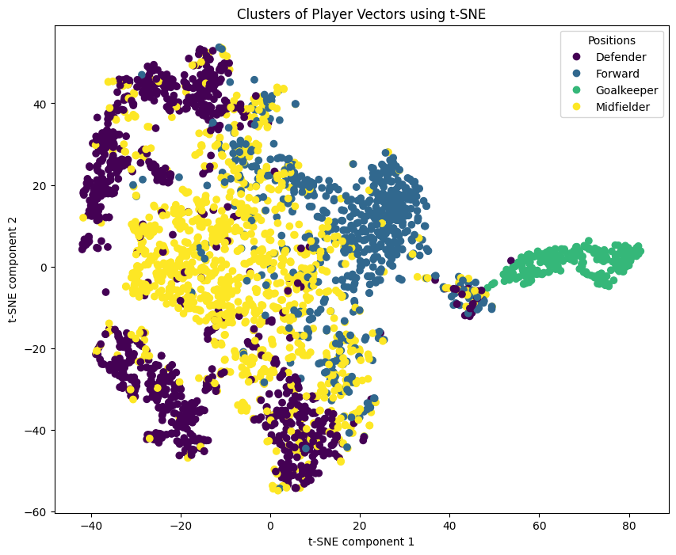

# playervectors-ai
Clustering and predicting PlayerVectors using Machine Learning and Deep Learning algorithms.

## Player Vectors
Player Vectors summarise the playing styles of individual football players.

## Cluster Player Vectors using t-SNE

## Predicting Player positions using Player Vectors

Used Classification Models:

* K Nearest Neighbour Classifier
* Suppor-Vector Classifier
* Decission Tree Classifier
* Random Forest Classifier
* Gradient Boosted Decission Tree Classifier
* Multilayer Perceptron

### Accurcay scores

### Confusion matrices of classifiers
